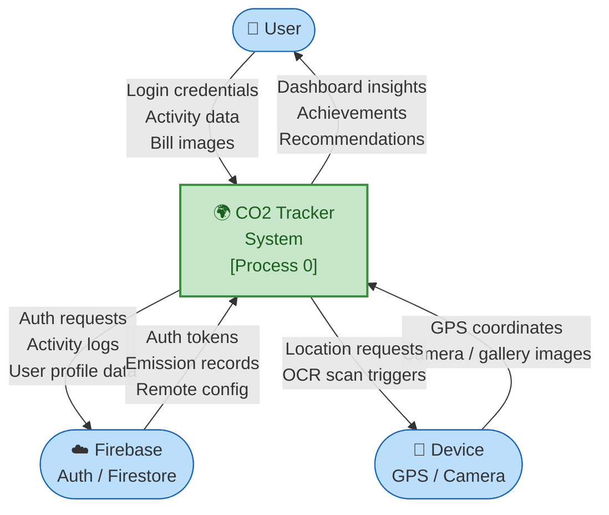
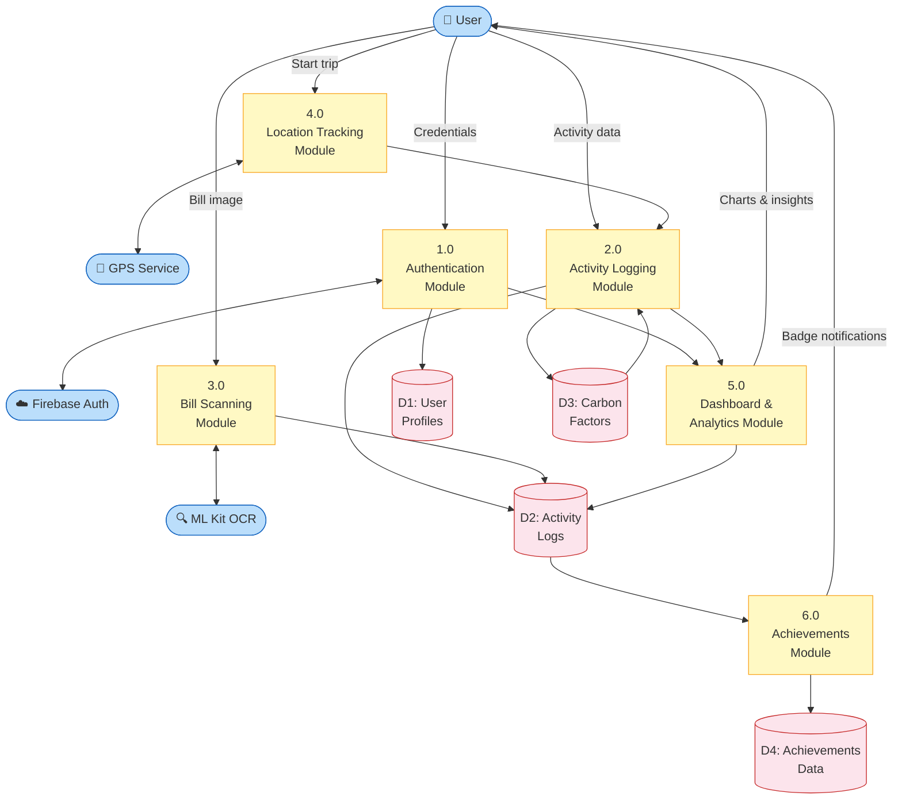
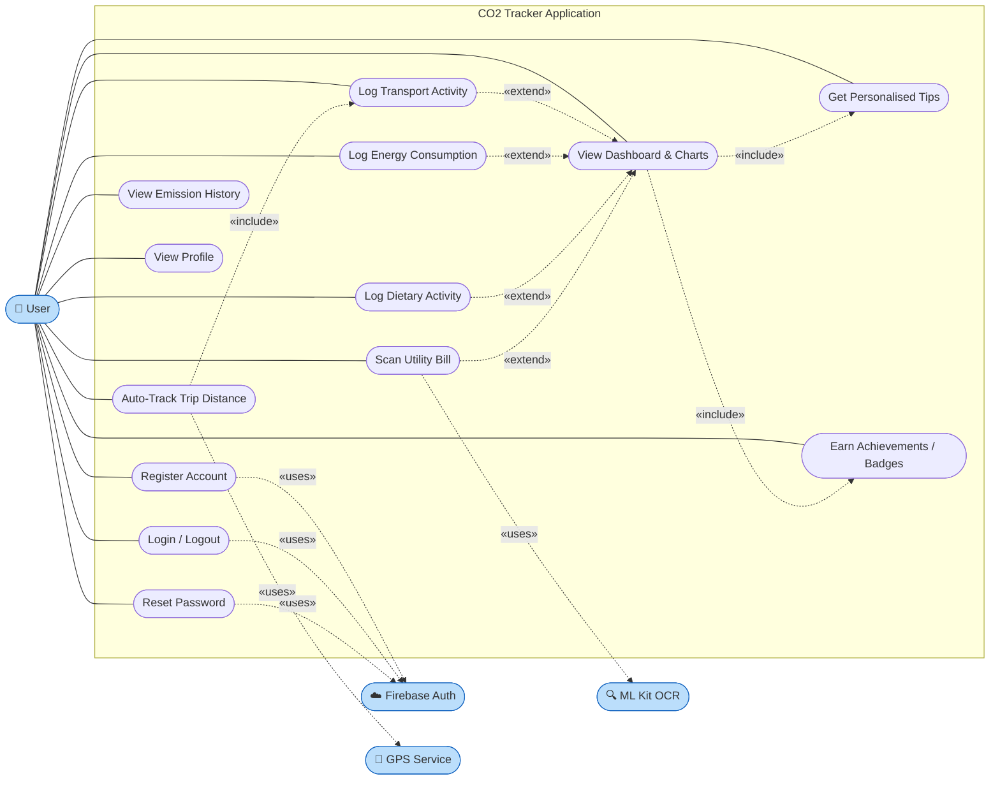
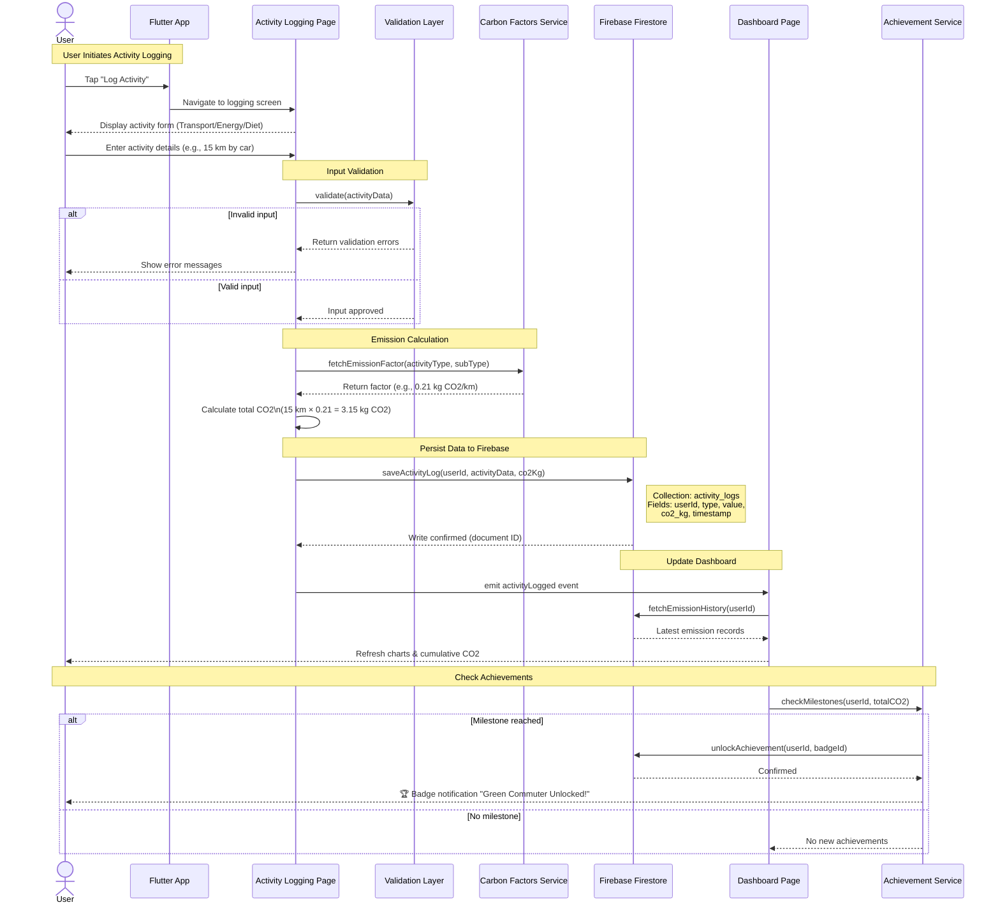
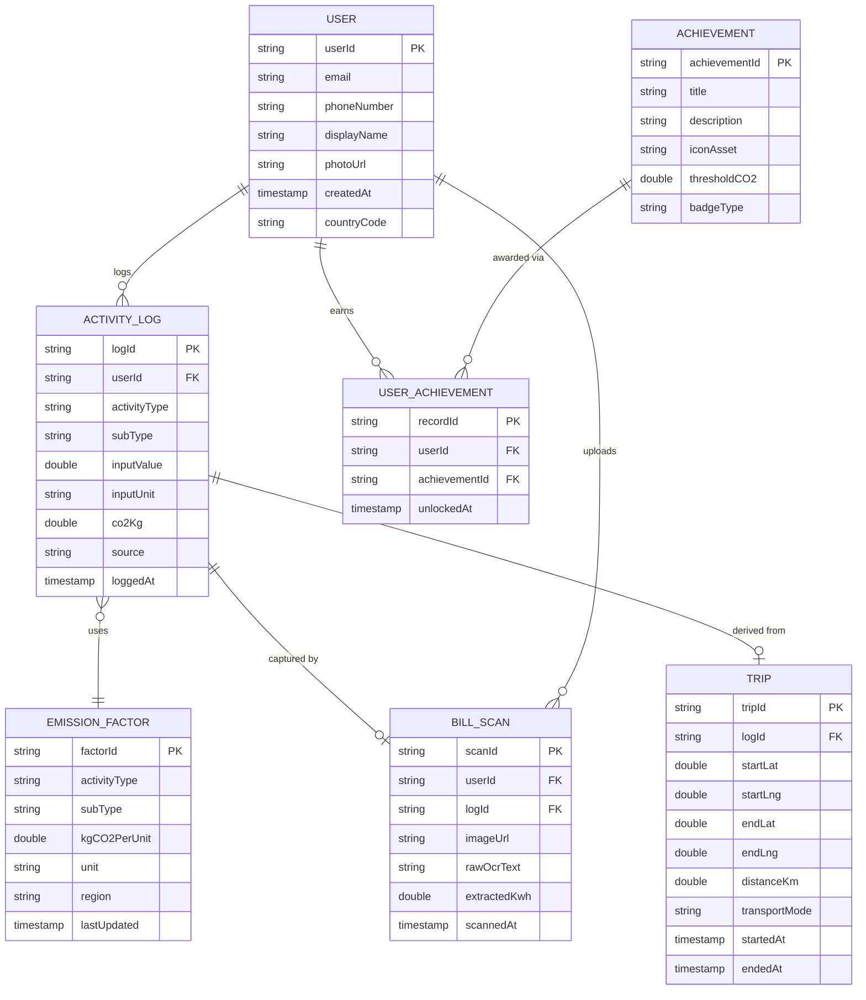

# CO2 Tracker Application

**A comprehensive carbon footprint tracking and analysis application built with Flutter.**

## ABSTRACT
The CO2 Tracker application is designed to help individuals and organizations monitor, manage, and reduce their carbon footprint. By logging daily activities such as transportation, energy consumption, and dietary habits, the application calculates the estimated CO2 emissions using standardized environmental factors. The integrated OCR capabilities allow for quick logging of utility bills, while real-time location services automate trip distance calculations. Through visually engaging dashboards, personalized insights, and an achievement system, the platform gamifies the experience of emission reduction, fostering environmentally conscious behavior.

---

## 1. INTRODUCTION

### 1.1 Background of the Study
With the increasing threat of global warming, tracking personal and organizational carbon emissions has become crucial. While many web-based tools exist, there is a distinct lack of accessible, engaging mobile applications that automate the data entry process and provide actionable, localized insights.

### 1.2 Problem Statement
Individuals struggle to manually track their daily environmental impact due to complex calculations and a lack of immediate, understandable feedback. Without automated tracking and gamified motivation, user retention in sustainability apps remains low.

### 1.3 Objectives
- To develop a cross-platform mobile application for tracking CO2 emissions.
- To integrate OCR for automated data entry from utility bills.
- To utilize device location services for automatic transportation tracking.
- To provide personalized recommendations and an achievement system to encourage sustainable choices.

### 1.4 Scope of the Project
The application is limited to personal carbon footprint tracking using mobile platforms (Android/iOS). It integrates with Firebase for authentication and real-time database synchronization.

### 1.5 Organization of the Report
This document adheres to the standard software engineering report format, detailing the literature review, requirements specification, system design, implementation details, testing strategy, and concluding remarks.

| Section | Title |
|---------|-------|
| 2 | Literature Review |
| 3 | Software Requirements Specification (SRS) |
| 4.1 | Overall System Architecture |
| 4.2 | Module Description |
| 4.3 | Data Flow Diagrams |
| 4.3.1 | Level 0 DFD (Context Diagram) |
| 4.3.2 | Level 1 DFD |
| 4.4 | Use Case Diagram |
| 4.5 | Sequence Diagram — CO2 Activity Logging Flow |
| 4.6 | Entity-Relationship Diagram |
| 5 | Implementation |
| 6 | Testing |
| 7 | Results & Discussion |
| 8 | Conclusion & Future Works |

---

## 2. LITERATURE REVIEW

### 2.1 Introduction to Existing Systems
Existing applications like *JouleBug* and *Klima* offer generic carbon tracking but often lack deep integration with automated capture methods like Optical Character Recognition (OCR) for exact billing data or real-time location-based trip logging.

### 2.2 Product Comparison & Constraints
Most existing tools suffer from generic carbon offset data and manual input fatigue. By leveraging on-device sensors (GPS) and machine learning (ML Kit), the CO2 Tracker minimizes manual user input, directly addressing the primary limitation found in conventional tracking software. 

### 2.3 Proposed System Overview
The proposed system bridges this gap by offering a fully integrated Flutter solution that relies heavily on device-native features, automated data ingestion, and Firebase's robust backend architecture.

---

## 3. SOFTWARE REQUIREMENTS SPECIFICATION (SRS)

### 3.1 Purpose
This section outlines the software and hardware requirements needed to deploy and maintain the CO2 Tracker application.

### 3.2 Overall Description
The product is a mobile application running on Android and iOS devices, aimed at environmentally conscious individuals. 

### 3.3 Functional Requirements
- **FR1 (Authentication):** Users must be able to sign up, log in, and reset passwords via Email or Phone Number.
- **FR2 (Activity Logging):** Users can manually log transport, electricity, and dietary activities.
- **FR3 (Automated Logging):** The system shall extract usage data from uploaded bills via Google ML Kit OCR.
- **FR4 (Location Tracking):** The system shall calculate transport distances via Geolocator.
- **FR5 (Dashboard & Analytics):** The system shall visualize emissions data using interactive charts (fl_chart).

### 3.4 Non-Functional Requirements
- **Performance:** App must load the main dashboard within 2 seconds.
- **Scalability:** Firebase backend must support thousands of concurrent users.
- **Security:** User data and activity logs must be secured using Firebase Authentication and Firestore rules.
- **Usability:** The interface must feature high-contrast, modern UI/UX with smooth animations.

### 3.5 Development Environment
- **SDK:** Flutter (>=3.0.0 <4.0.0), Dart
- **Database:** Firebase Cloud Firestore
- **State Management:** Provider / Local State with SharedPreferences
- **Key Dependencies:** `firebase_core`, `fl_chart`, `geolocator`, `google_mlkit_text_recognition`, `percent_indicator`

---

## 4. SYSTEM ANALYSIS AND DESIGN

### 4.1 Overall System Architecture
The application uses a modular Client-Server architecture. The Flutter client handles the UI, local state, and device sensor integration, while Firebase provides cloud functions, database, and authentication services.

### 4.2 Module Description
- **Authentication Module:** Handles login/signup (`login_page.dart`, `sign_up_page.dart`, `phone_auth_page.dart`).
- **Activity Module:** Manages the logging of carbon-emitting actions (`log_activity_page.dart`, `scanner_page.dart` using `ocr_service.dart`).
- **Dashboard Module:** Visualizes data using pie charts and graphs (`dashboard_page.dart`).
- **Achievements Module:** Gamifies the experience (`achievements_page.dart`).
- **Core Services:** Reusable business logic layers (`carbon_factors.dart`, `location_service.dart`, `suggestion_service.dart`).

---

### 4.3 Data Flow Diagrams

> **Source files:** `docs/diagrams/dfd_level0.puml` / `dfd_level0.mmd` and `docs/diagrams/dfd_level1.puml` / `dfd_level1.mmd`
>
> **Render with:** [PlantUML](https://plantuml.com/), [Mermaid Live Editor](https://mermaid.live/), or ask Claude — paste the code block below and request a rendered PNG.

#### 4.3.1 Level 0 DFD (Context Diagram)

The context diagram shows the entire CO2 Tracker system as a single process, surrounded by the three external entities it interacts with.

#### 4.3.2 Level 1 DFD

The Level 1 DFD decomposes the central process into the six primary functional modules and shows how data flows between them, the external actors, and the four Firestore data stores.

---

### 4.4 Use Case Diagram

> **Source files:** `docs/diagrams/use_case.puml` / `use_case.mmd`

---

### 4.5 Sequence Diagram — CO2 Activity Logging Flow

> **Source files:** `docs/diagrams/sequence_activity_logging.puml` / `sequence_activity_logging.mmd`

The sequence diagram traces the end-to-end lifecycle of a user logging a carbon-emitting activity — from form submission through emission calculation, Firebase persistence, dashboard refresh, and achievement checking.

---

### 4.6 Entity-Relationship Diagram

> **Source files:** `docs/diagrams/er_diagram.puml` / `er_diagram.mmd`

---

## 5. IMPLEMENTATION

### 5.1 Project Structure
The `lib/` directory is logically grouped into `pages/`, `services/`, and core configurations like `theme/app_theme.dart` and `main_navigator.dart`.

### 5.2 Key Implementations
- **OCR Integration:** Utilizes `google_mlkit_text_recognition` to scan and parse textual data from electric/gas bills, drastically reducing user input time.
- **Dynamic Theming:** Implements a personalized design system using `flutter/material` and `cupertino_icons`.
- **Data Visualization:** Employs the `fl_chart` library to render complex datasets into easily understandable visual insights.

---

## 6. TESTING

### 6.1 Testing Strategy
- **Unit Testing:** Validating core calculation functions within `carbon_factors.dart` and `simulation_service.dart`.
- **Widget Testing:** Ensuring the UI components render correctly across different screen sizes.
- **Integration Testing:** Validating the end-to-end flow from logging an activity to its appearance on the dashboard.

### 6.2 Test Case Table (Sample)
| Test ID | Module | Description | Expected Result | Status |
|---|---|---|---|---|
| TC_01 | Auth | User logs in with valid credentials | Redirected to Dashboard | Pass |
| TC_02 | Activity | Log 10km car trip | Dashboard adds standard CO2 value | Pass |
| TC_03 | Scanner | Scan clear utility bill image | Usage numbers automatically filled | Pass |

---

## 7. RESULTS & DISCUSSION

### 7.1 Output Results
The implementation resulted in a highly responsive mobile application. The integration of OCR and location services successfully minimized the manual input previously required by users.

### 7.2 Comparison with Existing Systems
Unlike competitors that rely solely on approximations, CO2 Tracker utilizes precise distance measurements and exact bill values, offering a significantly higher degree of accuracy in footprint calculations.

---

## 8. CONCLUSION & FUTURE WORKS

### 8.1 Conclusion
The CO2 Tracker application successfully meets all outlined objectives, providing a seamless, gamified approach to tracking carbon emissions. By leveraging modern mobile capabilities like ML and GPS, the app lowers the barrier to entry for users wanting to adopt a sustainable lifestyle.

### 8.2 Future Scope
- Integration with smart home APIs (e.g., Google Nest) for direct energy consumption reading.
- A social leaderboard to compete with friends and local community members.
- Advanced AI-driven predictive insights for optimizing daily commutes.

---

## REFERENCES
1. Flutter Documentation: https://flutter.dev/docs
2. Firebase Realtime Database and Authentication: https://firebase.google.com/
3. Google ML Kit for Text Recognition: https://developers.google.com/ml-kit
4. Geolocation mapping standards for mobile applications.

## APPENDIX
- **A.** Source Code Repository link.
- **B.** Prototype Screenshots.
- **C.** Setup and Installation Guide.
